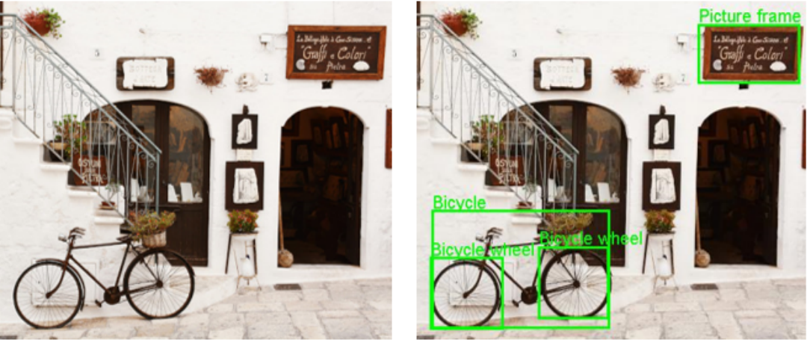

<h1 align="center"> Cloud Image Detection </h1>

<p align="center">
This project was developed during the Cloud Computing course.
</p>

<p align="center">
  <a href="#technologies">Technologies</a>&nbsp;&nbsp;&nbsp; |&nbsp;&nbsp;&nbsp;
  <a href="#project">Project</a>&nbsp;&nbsp;&nbsp; |&nbsp;&nbsp;&nbsp;
  <a href="#layout">Layout</a>&nbsp;&nbsp;&nbsp; |&nbsp;&nbsp;&nbsp;
  <a href="#license">License</a>
</p>

<p align="center">
  
</p>

<br>

<p align="center">
  
</p>

## Technologies

This project was developed with the following technologies:

- Java
- Google Cloud Platform
- Maven
- Git
- GitHub

## Project

This project's main goal was to develop a system to detect multiple objects in images and generate new images with the object areas marked. It is also possible to obtain information about the processed images or obtain all images with a specific object.

### 🚀 Getting Started

1.  **Necessary installations to run the application.**

    ```shell
    # Install Maven
      [maven](https://maven.apache.org/install.html)
    ```


    ```shell
    # Install Java
      [Java 11](https://www.oracle.com/pt/java/technologies/javase/jdk11-archive-downloads.html)
    ```

2.  **The next step is to open in your IDE the contract and install it**

    Navigate into your maven sidebar options and make package and install of the proto contract.

    ```shell
      maven package
      maven install
    ```
   

3.  **Start application**

    Open the client the server and the subscriber client and build them up!

    ```shell
      build CNClientApp 
      build CNImageServiceImplBase
      build CNSubClientApp
    ```

<br>

## Layout

It wasn't developed a front-end view for this service, so it uses the console to make the requests.

## :memo: License

This project is under the MIT License.

---

Developed by [Tiago Cebola](https://github.com/TiagoCebola) & [Gustavo Campos](https://github.com/gustavodev1998) & [Inês Sampaio](https://github.com/inessampaio), belonging to the LEIRT61D class at ISEL. :wave:
